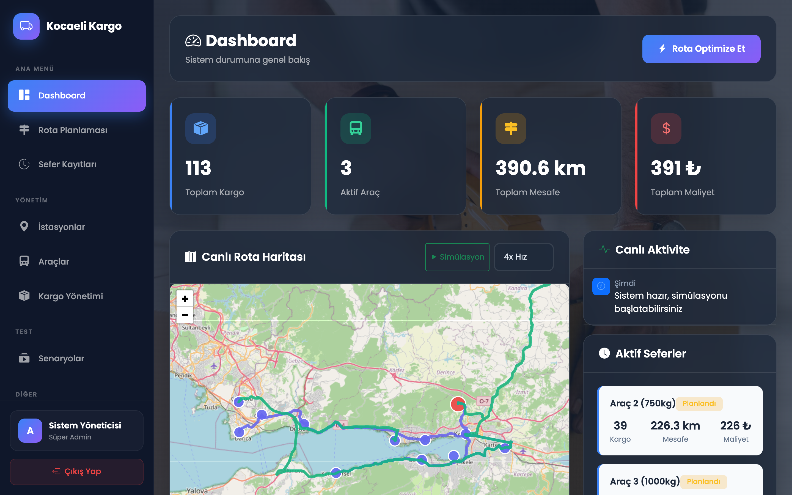
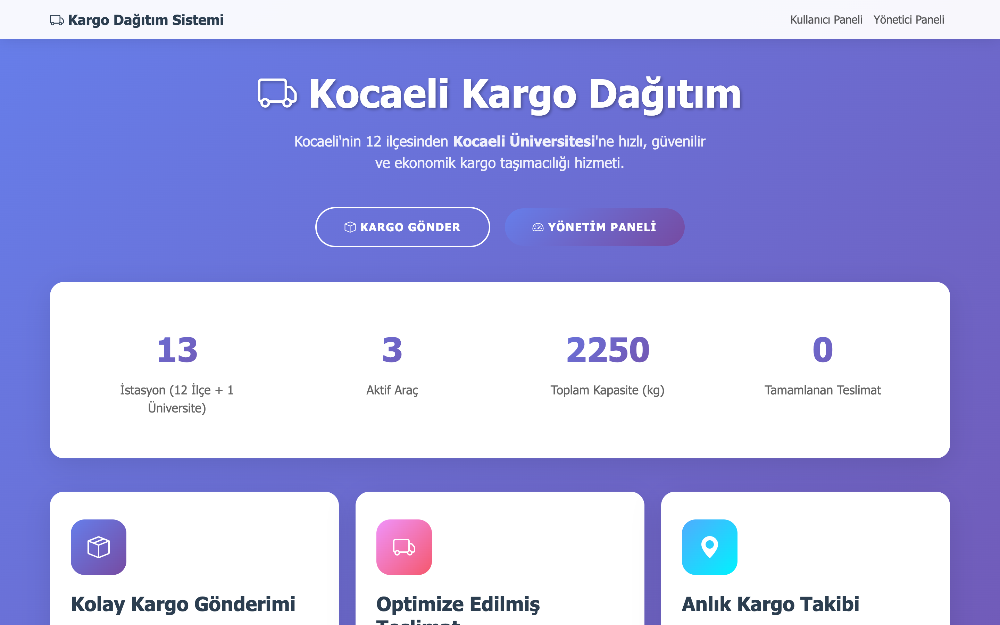

# Kocaeli Üniversitesi Kargo Dağıtım Sistemi

Kocaeli'nin 12 ilçesinden Kocaeli Üniversitesi'ne (Umuttepe Kampüsü) kargo
taşımacılığı için yük ve rota planlaması yapan, **genetik algoritma** ve
**Clarke-Wright** tabanlı bir optimizasyon sistemi. Flask ile geliştirildi.

## Ekran görüntüleri

Optimize edilmiş rotaların canlı harita üzerinde gösterimi — hesaplanan
güzergahlar, araç bazında mesafe ve maliyet:





## Özellikler

- **Genetik algoritma (GA)** ile CVRP (Capacitated Vehicle Routing Problem) çözümü
- **Clarke-Wright Savings** algoritması ile rota birleştirme
- **A\*** ile yol bulucu — kuş uçuşu değil, gerçek yol ağı üzerinden mesafe
- **Knapsack** optimizasyonu ile araç yükleme
- **Leaflet.js + OpenStreetMap** ile interaktif harita (harici API anahtarı gerekmez)
- Kullanıcı ve yönetici panelleri, kullanıcı yalnızca kendi kargosunun güzergahını görür
- Kapasite aşımında otomatik kiralık araç desteği
- 4 farklı test senaryosu ve anlık sefer kaydı

## Algoritmalar

| Algoritma | Kullanım | Parametreler |
|---|---|---|
| **Genetik Algoritma** | CVRP çözümü | Popülasyon 100 · 500 nesil · mutasyon 0.1 · çaprazlama 0.8 · 10 seçkin · 2-opt yerel arama |
| **Clarke-Wright** | Rota birleştirme | `s(i,j) = d(depo,i) + d(depo,j) − d(i,j)`, kapasite ve bölge kısıtlı |
| **A\*** | Yol bulma | Haversine sezgisel · yol faktörü 1.35× |
| **Knapsack** | Araç yükleme | Dinamik programlama · öncelikli kargo seçimi |

## Kurulum

```bash
# 1) Depoyu klonlayın
git clone https://github.com/selimdogann/kargo-rota-optimizasyonu.git
cd kargo-rota-optimizasyonu

# 2) Sanal ortam
python3 -m venv .venv
source .venv/bin/activate          # Windows: .venv\Scripts\activate

# 3) Bağımlılıklar
pip install -r requirements.txt

# 4) Veritabanını oluşturun
python init_db.py

# 5) Çalıştırın
python app.py
```

Ardından tarayıcıda:

- Ana sayfa — <http://localhost:5000>
- Kullanıcı paneli — <http://localhost:5000/user>
- Yönetici paneli — <http://localhost:5000/admin>

> **macOS notu:** 5000 portu AirPlay tarafından kullanılıyorsa `app.py` içindeki
> port numarasını (örn. 5055) değiştirin.

Örnek yönetici girişi: `admin@kargo.com` / `admin123` (yalnızca demo verisi).

## İstasyonlar

Depo **Kocaeli Üniversitesi**, teslimat noktaları 12 Kocaeli ilçesidir:

| İstasyon | Tip | Koordinat |
|---|---|---|
| **Kocaeli Üniversitesi** | Ana depo | 40.8225, 29.9213 |
| İzmit | İlçe | 40.7656, 29.9406 |
| Gebze | İlçe | 40.8027, 29.4307 |
| Darıca | İlçe | 40.7694, 29.3753 |
| Çayırova | İlçe | 40.8267, 29.3728 |
| Dilovası | İlçe | 40.7847, 29.5369 |
| Körfez | İlçe | 40.7539, 29.7636 |
| Derince | İlçe | 40.7544, 29.8389 |
| Gölcük | İlçe | 40.7175, 29.8306 |
| Karamürsel | İlçe | 40.6917, 29.6167 |
| Başiskele | İlçe | 40.7244, 29.9097 |
| Kandıra | İlçe | 41.0706, 30.1528 |
| Kartepe | İlçe | 40.7389, 30.0378 |

## Araç filosu

| Araç | Kapasite | Maliyet |
|---|---|---|
| Araç 1 | 500 kg | 1.0 ₺/km |
| Araç 2 | 750 kg | 1.0 ₺/km |
| Araç 3 | 1000 kg | 1.0 ₺/km |
| Kiralık | 500 kg | 200 ₺/gün + 1.0 ₺/km |

Toplam sabit kapasite: **2250 kg**; aşımda kiralık araç devreye girer.

## Test senaryoları

1. **Orta yük (1445 kg)** — kapasite yeterli, kiralama gerekmez
2. **Dengesiz dağılım (905 kg)** — kapasite yeterli ama dağılım dengesiz
3. **Kapasite aşımı (2700 kg)** — kiralık araç gerekli
4. **Yoğun hafif yük (1150 kg)** — minimum maliyet hedefi

## API

| Uç nokta | Açıklama |
|---|---|
| `GET/POST/DELETE /api/stations` | İstasyon listele / ekle / sil |
| `GET/POST /api/cargos`, `GET /api/cargos/track/<no>` | Kargo yönetimi ve takip |
| `GET/POST /api/vehicles` | Araç yönetimi |
| `POST /api/routes/optimize`, `GET /api/routes/active` | Rota optimizasyonu ve aktif rotalar |
| `POST /api/scenarios/load/<id>` | Test senaryosu yükle |
| `GET /api/analytics/summary` | Özet istatistikler |

## Proje yapısı

```
kargo-rota-optimizasyonu/
├── app.py                       # Ana Flask uygulaması
├── init_db.py                   # Veritabanı başlatma
├── requirements.txt
├── algorithms/
│   ├── genetic_algorithm.py     # GA + Knapsack
│   ├── clarke_wright.py         # Clarke-Wright Savings
│   ├── distance_calculator.py   # A* ve mesafe hesaplama
│   └── scenarios.py             # Test senaryoları
├── templates/                   # index, user_panel, admin_panel, giriş/kayıt
└── static/                      # css, js
```

## Lisans

MIT — bkz. [LICENSE](LICENSE).

## Geliştirici

**Selim Doğan** — Kocaeli Üniversitesi, Bilgisayar Mühendisliği (Yazılım Laboratuvarı projesi)
